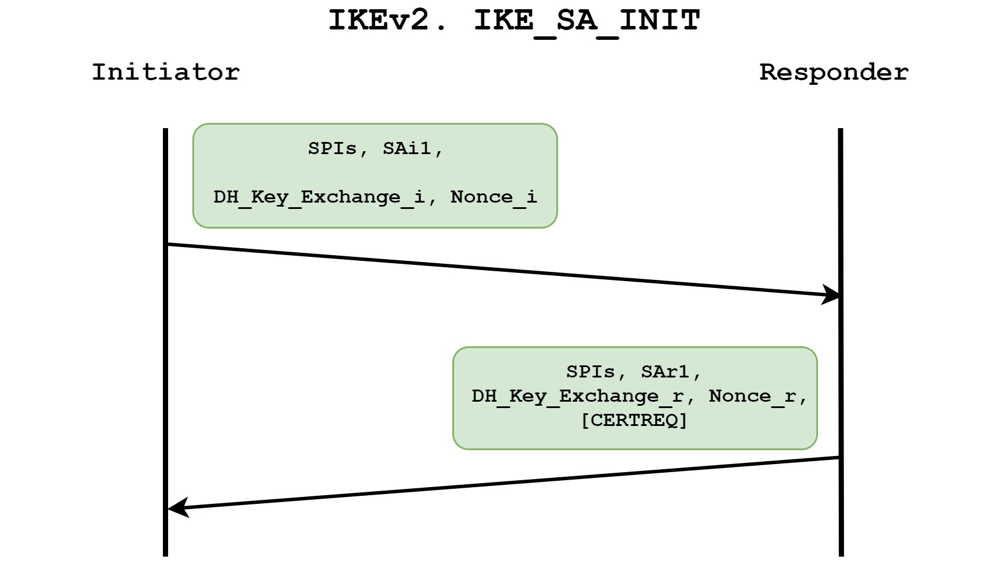
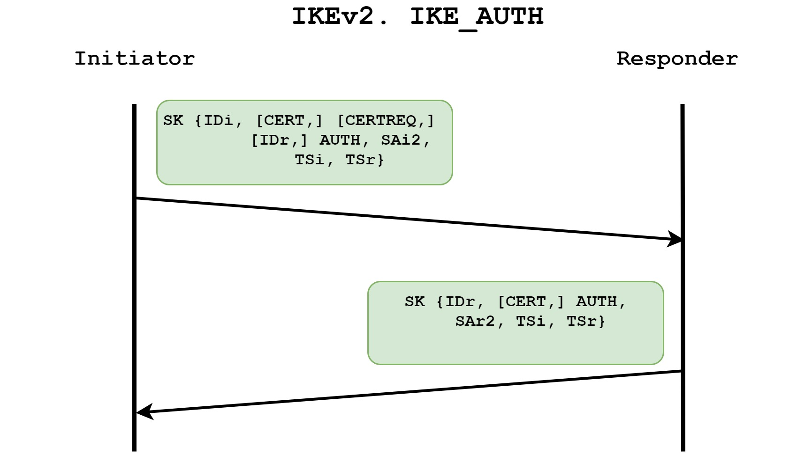

# VPNs

https://www.firewall.cx/networking/network-protocols/ipsec-modes.html
https://datahacker.blog/industry/technology-menu/networking/vpn

each *fortigate* or *router* will act as a *vpn gateway* for his LAN.

> **Tunneling** 
is a network technology that enables the 
encapsulation of one type of protocol packet within 
the datagram of a different protocol.

## IPSec

**1. Introduction to IPSec:**

Objective: Provide security services for IP packets, including encryption, authentication, protection against replay, and data confidentiality.
Protocols: Encapsulating Security Payload (ESP) and Authentication Header (AH).

### 2. IPSec Modes - Tunnel vs. Transport:

Tunnel Mode: Default mode where the entire original IP packet is protected by IPSec. Used between gateways or end-station to gateway.
Transport Mode: Used for end-to-end communications, protecting the IP payload. Common for client-server or workstation-gateway communication.

**3. IPSec Tunnel Mode:**

Function: Wraps, encrypts, and adds a new IP header to the original packet.
Use Cases: Between secure IPSec Gateways (e.g., Cisco routers) or VPN clients and gateways.
Header Placement: IPSec header (AH or ESP) inserted between the IP header and upper layer protocol.
Illustration: Packet diagrams provided for both ESP and AH headers in Tunnel mode.

**4. IPSec Transport Mode:**

Function: Protects the IP payload in end-to-end communication.
Use Cases: Encrypted sessions, e.g., Telnet or Remote Desktop, between a client and a server or workstation and a gateway.
Header Placement: IPSec headers encapsulate the IP payload; original IP headers remain intact.
Illustration: Packet diagrams for both ESP and AH headers in Transport mode.

### ESP vs AH:

**5. ESP vs. AH in Tunnel and Transport Modes:**

Tunnel Mode: ESP commonly used; AH may be used alone or with ESP.
Transport Mode: ESP commonly used; AH may be used alone or with ESP.
Header Identification: ESP identified with IP protocol ID 50, AH with ID 51.

**6. Conclusion:**

Choice of Mode: Depends on specific requirements and implementation of IPSec.
Application: Tunnel mode for secure gateways, transport mode for end-to-end communications.
This summary organizes key information from the provided article, distinguishing between IPSec Tunnel Mode and IPSec Transport Mode, and highlighting the role of ESP and AH in different scenarios.

## IKEv1

## IKEv2

>Goal: Securely share a symetric key between 2 network peers who want to communicate via an IPSec VPN
>it does it in 2 phases 

- Pre-shared keys are not used in encripting IKEv2 - only DH values are used
- Nuilt-in NAT-T support
- EAP support for authentication
- allow flexible auth choices (asymetrical)

All IKE communications consist of pairs of messages: a request and a response. The pair is called an “exchange“. The goal is to build a *secured tunnel* – Security Association (SA) for IPSec management traffic (**IKE SA**) and then be able to build *tunnels for data traffic* (**Child SA**).

Communication using IKE always begins with *IKE_SA_INIT* and *IKE_AUTH* exchanges. These initial exchanges normally consist of four messages, though in some scenarios that number can grow

### NAT-T

Why use NAT-T ?
    - because ESP protocol port number is 50 and doesn't support port address translation 
    - NAT-T allows IKEv2 to work through NAT devices by encapsulating IKEv2 traffic within UDP packets. This encapsulation helps maintain consistent IP addresses within the VPN packets, making it possible for the VPN connection to traverse NAT boundaries.

The detection of NAT-T is based on the NAT_DETECTION_SOURCE_IP and NAT_DETECTION_DESTINATION_IP notifications sent in the `IKE_SA_INIT` exchange that contain source and destination IP address hashes, respectively.

In most cases, the IPSec device is also the gateway for your LAN, so there is probably a NAT configuration. Traffic is checked for NAT before it is checked for IPSec [NAT Order of Operation], so make sure that traffic that should be forwarded with IPSec is not NATted for outside world.

Not all VPNs support NAT across the VPN. When they do, it's a feature called NAT-T

single device to internet via VPN : no worries
connect 2 networks together : pay attention to NAT-T 

### IKE_SA_INIT

the first pair of messages:
    - negociate cyprographic algorithms 
    - provide NAT detection
    - exchange nonces
    - do DH Exchange

Security Parameter Index (SPI) is a 64-bit identifier, a pair of SPIs uniquely identifies the IKEv2 session.

the initiator send a list of Security Attributes that can be used for the IKE SA - Proposals (SAi1)
- Encryption algorithms
- PRF - hash algorithm
- DH group
- Integrity Algorithm

the responder picks the one that is compliant with logically configured attributes (SAr1).
if the responder decline the DH group and want another, an additional exchange will be done.

SKEYSEED is calculated during this IKE_SA_INIT exchange using the nonces, and DH shared secret is established during that exchange  
unlike IKEv1, IKEv2 does not use pre-shared key for IKEv2 SA.

NAT is detected by including a hash of (ip and port numbers), if received hash does not match hash of the one locally calculated then there is a NAT device. 
    Once NAT is detected, all further communication (IKE_AUTH and ESP payload) switches from UDP port 500 to UP port 4500 

### IKE_AUTH

Parts of *IKE_AUTH* messages are **encrypted** and **integrity** protected with keys established through the *IKE_SA_INIT* exchange
    so *identities are hidden* from eavedroppers
    and all fields in all *messages are authenticated*. 

IKE_AUTH messages:
-  authenticate the previous messages
-  exchange identities and/or certificates
-  and establish the first CHILD_SA (IPSec SA for data traffic) based on SA proposals and Traffic Selectors included

Traffic Selectors identify traffic that is a subject to be forwarded via IPSec tunnel (Source and Destination addresses/subnets, protocol and port numbers)

## IKEv1 vs IKEv2

- IKEv1 does authentication and encryption in 2 distinctive phases(phase 1 & 2), 
    each phase consist of predefined number of message exchanges  
- IKEv2 does not have same distinction
     IKEv2 defines message exchanges but does not limits the number of messages in them.

- unlike IKEv1, IKEv2 does not use pre-shared key for IKEv2 SA.

## Phase 1 
Phase 1 is a negotiation process that establishes a secure, authenticated IKEv2 Security Association (IKEv2 SA) between two (2) network peers. 
Phase 1 manages the **authentication** of both network peers and establishes an agreement on which **encryption methods** will be used for Phase 2. A separate security policy (in the form of an IKEv2 SA) is implemented for each IKEv2 peer. Normally, there are only two (2) peers.

Phase 1 uses **X.509 certificates for *authentication*** and **Diffie-Hellman key exchanges for *encryption***. The X.509 certificates must be either arranged ahead of time (pre-shared) or may be exchanged via DNS or DNSSEC.

Phase 1 defines:

- Global parameters, such as the names of public key certificates
- Whether perfect forward secrecy (PFS) is to be used
- Network interfaces affected
- Security protocols and their algorithms
- Authentication method

Phase 1 has two (2) different implementation methods. "Main Mode" is the default configuration and uses cryptographic keys to protect the transmission between the two (2) network peers. "Aggressive Mode" is optional, and sacrifices security for speed. The latter should never be used across the Internet.

**Main Mode**:
    IKEv2 Phase 1 Main Mode (default) uses PKI-based keys to authenticate both network peers.

**Aggressive Mode**:
    The sanctity of the IKEv2 Phase 2 cryptographic keys is critical in preventing a cascade effect of key compromises.

>IKEv2 Phase 1 should not be run in Aggressive Mode over an insecure network, such as the Internet.

IKEv2 Phase 1 Aggressive Mode is faster than the default Main Mode, but transmits all information in the clear (plain text) with no authentication protection. Aggressive Mode should be avoided when possible as it is particularly vulnerable to Man-in-the-Middle (MitM) attacks, providing an attacker with the opportunity to alter the security association parameters for Phase 2. For example, allowing an attacker the opportunity to force a lower-level encryption method that is substantially easier to break.

>IKEv2's design presumes operation in a hostile environment where it is vulnerable to Man-in-the-Middle (MitM) and similar attack vectors.
The primary goal of Phase 1 is to delay an attacker long enough to execute Phase 2.4

## Phase 2 

In Phase 2, IKE negotiates IPSec's Phase 2 SA parameters and sets up matching IPSec SAs in the peers (one for outbound communications and one for inbound). At the end of Phase 2, both peers hold a symmetric shared key for IPsec.

IKEv2 Phase 2's roles and responsibilities are:

Creates two (2) uni-directional tunnels used for end-user packets encryption/decryption
Negotiate IPsec security protocols
ESP and/or AH
Hash algorithm (SHA)
Encryption algorithm (if required)
IKEv2 Phase 2 and PFS
If PFS (Perfect Forward Secrecy) is not utilized, in Phase 2 IKE re-uses the same cryptographic key agreement used in Phase 1. When PFS is selected, a new symmetric key is generated at the beginning of Phase 2.

IKE and IPsec Security Associations
Right about now you may be pondering if the 2-phase Security Association process for IPsec and the 2-phase IKE SA processes are related. Yes, they are. IPsec and IKE's SA processes are intertwined. IKE also uses SAs, and IPsec relies on IKE to initiate IPsec's SA Phase Two process. Their order of operation looks like this:

- IPsec SA Phase 1 negotiation
- IKE SA Phase 1 negotiation
- IKE SA Phase 2 negotiation
- IPsec SA Phase 2 negotiation

---

Route-Based: 
    Fortigate automatically add a virtual interface with the VPN name
    Configure routing and firewall policies for IPSec Traffic the same way you do for non-IPSec traffic
    Leverage the presence of multiple connections to the same destination to achieve **redundancy** 
    you can enable dynamic routing protocols (= **Scalability**)
Policy-Based:
    Legacy, VPN matching based on policy, not recommended

## Firewall Policies for IPSec VPN

you must configure 2 policies, 
- allow inspect incoming traffic & outgoing traffic of the IPsec Virtual interface

### Redundant VPNs

- use 2 ISP on your site and deploy 2 IPSec VPNs, if the primary IPSec fails, the other can be used

 

