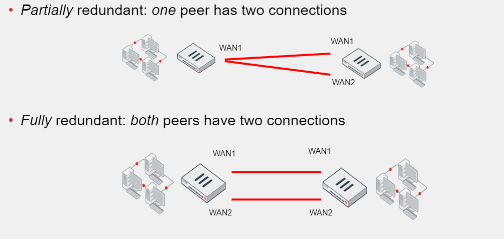

# PFE

https://www.firewall.cx/networking/network-protocols/ipsec-modes.html

each *fortigate* or *router* will act as a *vpn gateway* for his LAN.

> **Tunneling** 
is a network technology that enables the 
encapsulation of one type of protocol packet within 
the datagram of a different protocol.

## IPSec

**1. Introduction to IPSec:**

Objective: Provide security services for IP packets, including encryption, authentication, protection against replay, and data confidentiality.
Protocols: Encapsulating Security Payload (ESP) and Authentication Header (AH).

### 2. IPSec Modes - Tunnel vs. Transport:

Tunnel Mode: Default mode where the entire original IP packet is protected by IPSec. Used between gateways or end-station to gateway.
Transport Mode: Used for end-to-end communications, protecting the IP payload. Common for client-server or workstation-gateway communication.

**3. IPSec Tunnel Mode:**

Function: Wraps, encrypts, and adds a new IP header to the original packet.
Use Cases: Between secure IPSec Gateways (e.g., Cisco routers) or VPN clients and gateways.
Header Placement: IPSec header (AH or ESP) inserted between the IP header and upper layer protocol.
Illustration: Packet diagrams provided for both ESP and AH headers in Tunnel mode.

**4. IPSec Transport Mode:**

Function: Protects the IP payload in end-to-end communication.
Use Cases: Encrypted sessions, e.g., Telnet or Remote Desktop, between a client and a server or workstation and a gateway.
Header Placement: IPSec headers encapsulate the IP payload; original IP headers remain intact.
Illustration: Packet diagrams for both ESP and AH headers in Transport mode.

**5. ESP vs. AH in Tunnel and Transport Modes:**

Tunnel Mode: ESP commonly used; AH may be used alone or with ESP.
Transport Mode: ESP commonly used; AH may be used alone or with ESP.
Header Identification: ESP identified with IP protocol ID 50, AH with ID 51.

**6. Conclusion:**

Choice of Mode: Depends on specific requirements and implementation of IPSec.
Application: Tunnel mode for secure gateways, transport mode for end-to-end communications.
This summary organizes key information from the provided article, distinguishing between IPSec Tunnel Mode and IPSec Transport Mode, and highlighting the role of ESP and AH in different scenarios.

## IKEv1
## IKEv2
- Pre-shared keys are not used in encripting IKEv2 - only DH values are used
- Nuilt-in NAT-T support
- EAP support for authentication
- allow flexible auth choices (asymetrical)

All IKE communications consist of pairs of messages: a request and a response. The pair is called an “exchange“. The goal is to build a *secured tunnel* – Security Association (SA) for IPSec management traffic (**IKE SA**) and then be able to build *tunnels for data traffic* (**Child SA**).

Communication using IKE always begins with *IKE_SA_INIT* and *IKE_AUTH* exchanges. These initial exchanges normally consist of four messages, though in some scenarios that number can grow

### IKE_SA_INIT

the first pair of messages:
    - negociate cyprographic algorithms 
    - provide NAT detection
    - exchange nonces
    - do DH Exchange

[ike_init](images/ike.draw_io-ikev2.ike_sa_init.jpg)

Security Parameter Index (SPI) is a 64-bit identifier, a pair of SPIs uniquely identifies the IKEv2 session.

the initiator send a list of Security Attributes that can be used for the IKE SA - Proposals (SAi1)
- Encryption algorithms
- PRF - hash algorithm
- DH group
- Integrity Algorithm

the responder picks the one that is compliant with logically configured attributes (SAr1).
if the responder decline the DH group and want another, an additional exchange will be done.

SKEYSEED is calculated during this IKE_SA_INIT exchange using the nonces, and DH shared secret is established during that exchange  
unlike IKEv1, IKEv2 does not use pre-shared key for IKEv2 SA.

NAT is detected by including a hash of (ip and port numbers), if received hash does not match hash of the one locally calculated then there is a NAT device. 
    Once NAT is detected, all further communication (IKE_AUTH and ESP payload) switches from UDP port 500 to UP port 4500 

### IKE_AUTH

[ike_auth](./images/ike.draw_io-ikev2.ike_auth.jpg)

Parts of *IKE_AUTH* messages are **encrypted** and **integrity** protected with keys established through the *IKE_SA_INIT* exchange
    so *identities are hidden* from eavedroppers
    and all fields in all *messages are authenticated*. 

IKE_AUTH messages:
– authenticate the previous messages
– exchange identities and/or certificates
– and establish the first CHILD_SA (IPSec SA for data traffic) based on SA proposals and Traffic Selectors included

## IKEv1 vs IKEv2

- IKEv1 does authentication and encryption in 2 distinctive phases(phase 1 & 2), 
    each phase consist of predefined number of message exchanges  
- IKEv2 does not have same distinction
     IKEv2 defines message exchanges but does not limits the number of messages in them.

- unlike IKEv1, IKEv2 does not use pre-shared key for IKEv2 SA.

## Phase 1 
## Phase 2 

---

Route-Based: 
    Fortigate automatically add a virtual interface with the VPN name
    Configure routing and firewall policies for IPSec Traffic the same way you do for non-IPSec traffic
    Leverage the presence of multiple connections to the same destination to achieve **redundancy** 
    you can enable dynamic routing protocols (= **Scalability**)
Policy-Based:
    Legacy, VPN matching based on policy, not recommended

## Firewall Policies for IPSec VPN

you must configure 2 policies, 
- allow inspect incoming traffic & outgoing traffic of the IPsec Virtual interface

### Redundant VPNs

- use 2 ISP on your site and deploy 2 IPSec VPNs, if the primary IPSec fails, the other can be used

 

